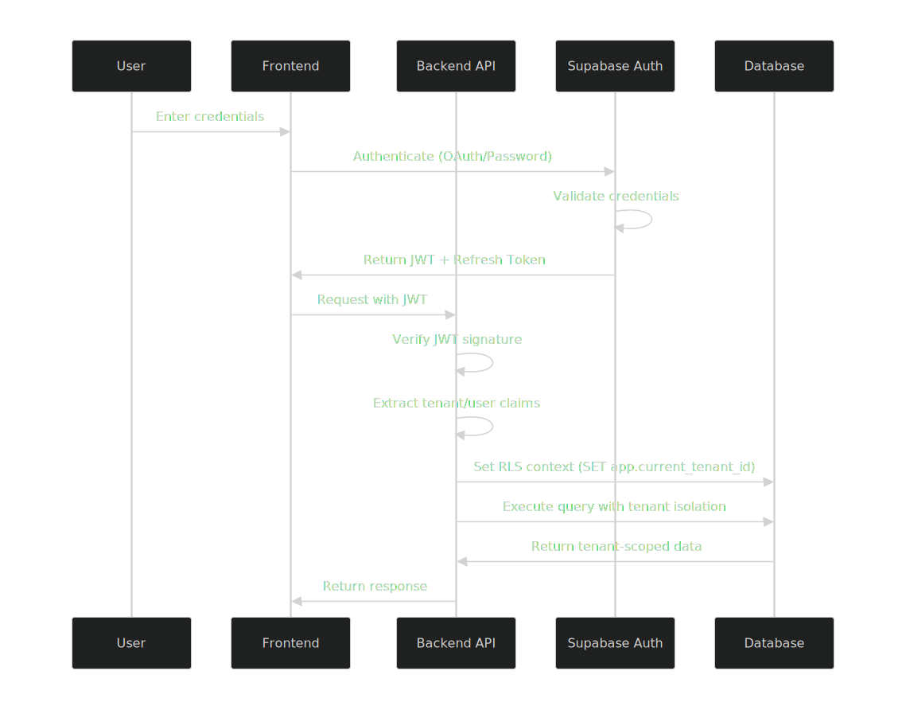

# Architecture Overview

Photo Listing SaaS is built with a focus on **multi-tenancy**, **scalability**, and **maintainability**. This document outlines the high-level architecture, design decisions, and technical considerations.

## System Architecture

### High-Level Overview



## Core Design Principles
1. **Multi-Tenancy First**: Complete data isolation at every layer

2. **Domain-Driven Design**: Business logic centered around domain models

3. **Clean Architecture**: Separation of concerns with clear boundaries

4. **Event-Driven**: Loose coupling between components

5. **Production-First**: Observability, security, and reliability built-in


## Multi-Tenancy Architecture

### Tenant Isolation Layers

| Layer     | Isolation Method        | Implementation                                  |
|-----------|-------------------------|-------------------------------------------------|
| Database  | Row-Level Security (RLS)| PostgreSQL policies with `tenant_id`            |
| Storage   | Path Prefixing          | `tenants/{tenant-id}/` in R2/S3                 |
| Cache     | Key Namespacing         | `tenant:{tenant-id}:{key}`                      |
| Events    | Tenant Context          | Events include `tenant_id` metadata             |
| Compute   | Request Context         | JWT claims with tenant context                  |

### Tenant Context Flow

```go
// Example of tenant context propagation
func TenantMiddleware() gin.HandlerFunc {
    return func(c *gin.Context) {
        // 1. Extract tenant from JWT or subdomain
        tenantID := extractTenantID(c)
        
        // 2. Validate tenant exists and is active
        tenant, err := tenantRepo.FindByID(tenantID)
        if err != nil {
            c.AbortWithStatusJSON(404, gin.H{"error": "tenant not found"})
            return
        }
        
        // 3. Set tenant context for this request
        ctx := context.WithValue(c.Request.Context(), "tenant", tenant)
        c.Request = c.Request.WithContext(ctx)
        
        // 4. Set PostgreSQL session variable for RLS
        db.SetTenantContext(tenantID)
        
        c.Next()
    }
}

```

## Layered Architecture

1. ### Presentation Layer (API)

    **Responsibilities**:
    - HTTP request/response handling
    - Authentication and authorization
    - Input validation and sanitization
    - Rate limiting and request tracing

    **Key Components**:
    - internal/interfaces/http/handlers/ - RESTful endpoint handlers
    - internal/middleware/ - HTTP middleware (auth, logging, etc.)
    - internal/docs/ - OpenAPI/Swagger documentation

2. ### Application Layer (Use Cases/Services)

    **Responsibilities**:
    - Use case orchestration
    - Transaction boundaries (via repositories / DB layer)
    - Domain event triggering (audit, notifications, usage)
    - Coordination of external services (Stripe, email, storage)

    **Key Components**:
        
    - /internal/domains/*/application/ - Business use cases

        Example: 
        internal/domains/auth/application/
        - login.go
        - signup.go
    
    **NOTE**: Each bounded context (domain) owns its own use cases (Domain Driven Design).

3. ### Domain Layer (Business Logic)

    **Responsibilities**:
    - Core business rules and invariants
    - Aggregate and entity definitions
    - Value object immutability
    - Domain events definitions
    - Zero dependencies on infrastructure or frameworks

    **Key Components**:

    - /internal/domains/*/domain - Core domain models (see domain README)

        Examples:
        - internal/domains/auth/domain/
            - user.go
            - domain_event.go

        - internal/domains/subscription/domain/
            - subscription.go
            - domain_event.go

4. ### Infrastructure Layer (Persistence & Integrations)

    **Responsibilities**:
    - Database persistence (PostgreSQL via sqlc)
    - External API integrations (Stripe, SendGrid)
    - Storage adapters (S3 / R2)
    - Observability, logging, tracing
    - Framework-specific implementations

    **Database & persistence**
    
        /internal/infrastructure/database/postgres/
        /internal/domains/*/infrastructure/repository/
        /internal/domains/*/infrastructure/repository/sqlc/

    Examples:

        tenant_repo.go
        user_repo.go
        audit_repo.go
        sqlc-generated queries per domain

    **External services**

    - Stripe
    ```text
        internal/domains/payment/infrastructure/stripe/stripe.go
    ```

    - Email (SendGrid)
    ```text
        internal/domains/notification/email/infrastructure/provider/sendgrid.go
    ```

    - Object Storage (S3)
    ```text
        internal/infrastructure/storage/s3_storage/s3_storage.go
    ```

    **Observability & cross-cutting infra**

    ```text
        internal/infrastructure/observability/tracing.go
        internal/logger/logger.go

    ```

## Event-Driven Architecture

### Event Types and Flow


### Event Guarantees

- **At-Least-Once Delivery**: With idempotent handlers
- **Transactional Safety**: Events stored with state changes
- **Order Preservation**: Per-aggregate event ordering
- **Retry with Backoff**: Exponential backoff for failures
- **Dead Letter Queue**: Manual inspection of failures

## Data Architecture

### Database Schema Highlights

```sql
-- Core tables with tenant isolation
CREATE TABLE IF NOT EXISTS tenants (
    id UUID PRIMARY KEY DEFAULT gen_random_uuid(),
    
    name VARCHAR(100) UNIQUE NOT NULL,

    created_at TIMESTAMPTZ NOT NULL DEFAULT now(),
    updated_at TIMESTAMPTZ NOT NULL DEFAULT now()
);

-- Trigger to keep updated_at fresh
CREATE TRIGGER trg_tenants_updated_at
BEFORE UPDATE ON tenants
FOR EACH ROW
EXECUTE FUNCTION set_updated_at();

-- Useful indexes
CREATE INDEX idx_tenants_created_at
    ON tenants(created_at);

CREATE INDEX idx_tenants_updated_at
    ON tenants(updated_at);


-- listings table
CREATE TABLE IF NOT EXISTS listings (
    id UUID PRIMARY KEY DEFAULT gen_random_uuid(),
    tenant_id UUID NOT NULL REFERENCES tenants(id) ON DELETE CASCADE,
    user_id UUID NOT NULL REFERENCES users(id) ON DELETE CASCADE,
        
    title VARCHAR(200) NOT NULL,
    description TEXT,

    status TEXT NOT NULL DEFAULT 'draft'
        CONSTRAINT listing_status_check CHECK (status IN ('draft', 'published')),

    visibility TEXT NOT NULL DEFAULT 'private'
        CONSTRAINT listing_visibility_check CHECK (visibility IN ('private', 'public')),

    created_at TIMESTAMPTZ NOT NULL DEFAULT now(),
    updated_at TIMESTAMPTZ NOT NULL DEFAULT now(),
    deleted_at TIMESTAMPTZ  DEFAULT NULL,

    CONSTRAINT chk_listing_timestamps
        CHECK (updated_at >= created_at)
    
    -- Row-Level Security ensures tenant isolation
);

-- Attach shared trigger
CREATE TRIGGER trg_listings_updated_at
BEFORE UPDATE ON listings
FOR EACH ROW
EXECUTE FUNCTION set_updated_at();

-- Indexes (query-driven)
CREATE INDEX idx_listing_tenant_user
    ON listings(tenant_id, user_id);

CREATE INDEX idx_listing_tenant_status
    ON listings(tenant_id, status);

CREATE INDEX idx_listing_tenant_visibility
    ON listings(tenant_id, visibility);

CREATE INDEX idx_tenant_listing_created_at_desc
    ON listings (tenant_id, created_at DESC);

-- Enable RLS on all tenant-owned tables
ALTER TABLE listings ENABLE ROW LEVEL SECURITY;
CREATE POLICY tenant_isolation ON listings
    USING (tenant_id = current_setting('app.current_tenant_id')::uuid);
```

## Storage Architecture

```text
Cloudflare R2 Structure:
r2://photo-listing/
├── tenants/
│   ├── {tenant-id}/
│   │   ├── originals/     # Original uploaded files
│   │   ├── web/           # Web-optimized versions
│   │   ├── thumbnails/    # Multiple thumbnail sizes
│   │   └── watermarks/    # Client-specific watermarks
│   └── ...
├── system/
│   ├── avatars/          # User profile images
│   └── templates/        # Email/PDF templates
└── backups/
    ├── database/
    └── storage/
```

## Security Architecture

### Defence in Depth

| Layer       | Security Measures               | Implementation                      |
|-------------|---------------------------------|-------------------------------------|
| Network     | DDoS Protection, WAF            | Cloudflare Free Tier                |
| Transport	  | TLS 1.3, HTTPS Only	            | Let's Encrypt + Cloudflare          |
| Application |	JWT Auth, Input Validation, RLS	| Gin Middleware + PostgreSQL         |
| Data	      | Encryption at Rest, Signed URLs	| R2 Server-Side Encryption           |
| Operational |	Secret Rotation, Audit Logs 	| Fly.io Secrets + Structured Logging |

### Authentication Flow



## Observability Stack

### Three Pillars Implementation

```yaml
# docker-compose.monitoring.yml
services:
  prometheus:
    image: prom/prometheus
    volumes:
      - ./config/prometheus.yml:/etc/prometheus/prometheus.yml
      
  grafana:
    image: grafana/grafana
    environment:
      GF_SECURITY_ADMIN_PASSWORD: admin
    
  loki:
    image: grafana/loki
    command: -config.file=/etc/loki/local-config.yaml
    
  tempo:
    image: grafana/tempo
    command: -config.file=/etc/tempo.yaml
```

### Key Metrics Tracked

```go
// Custom metrics definition
var (
    httpRequests = promauto.NewCounterVec(
        prometheus.CounterOpts{
            Name: "photo_listing_http_requests_total",
            Help: "Total HTTP requests by tenant and endpoint",
        },
        []string{"tenant_id", "method", "endpoint", "status"},
    )
    
    photoUploads = promauto.NewHistogramVec(
        prometheus.HistogramOpts{
            Name:    "photo_listing_upload_duration_seconds",
            Help:    "Photo upload duration distribution",
            Buckets: prometheus.DefBuckets,
        },
        []string{"tenant_id", "album_id"},
    )
    
    tenantResourceUsage = promauto.NewGaugeVec(
        prometheus.GaugeOpts{
            Name: "photo_listing_tenant_resource_usage",
            Help: "Resource usage per tenant",
        },
        []string{"tenant_id", "resource_type"},
    )
)
```

## Scaling Considerations

### Horizontal Scaling Strategy

| Component   | Scaling Strategy                   | Implementation                  |
|-------------|------------------------------------|---------------------------------|
| API Servers |	Stateless, Auto-scaling	           | Fly.io + Load Balancer          |
| Workers	  | Queue-based, Auto-scaling          | NATS JetStream + Consumer Groups|
| Database	  | Read Replicas + Connection Pooling | Supabase + PgBouncer            |
| Cache	      |Redis Cluster	                   | Fly Redis + Key Sharding        |
| Storage	  | CDN + Multi-Region	               | Cloudflare R2 + Cache           |
|             |                                    |                                 |
### Database Scaling Patterns

```sql
-- Partitioning for large tenants
CREATE TABLE photos_partitioned (
    id UUID NOT NULL,
    tenant_id UUID NOT NULL,
    album_id UUID,
    -- ... other columns
) PARTITION BY LIST (tenant_id);

-- Create partition per tenant (automated)
CREATE TABLE photos_tenant_123 
PARTITION OF photos_partitioned 
FOR VALUES IN ('tenant-123-id');

-- Read replicas for scaling reads
-- Primary: writes
-- Replica-1: analytical queries
-- Replica-2: user-facing reads
```

## Development Workflow

### Local Development

```bash
# Full stack with monitoring
docker-compose -f docker-compose.yml -f docker-compose.monitoring.yml up

# Run tests
make test
make integration-test
make e2e-test

# Code generation
make generate  # sqlc, mockgen, etc.

# Database migrations
make migrate-up
make migrate-down

# Local deployment
make deploy-local
```

### CI/CD Pipeline

```yaml
# .github/workflows/ci.yml
name: CI/CD Pipeline
on: [push, pull_request]

jobs:
  test:
    runs-on: ubuntu-latest
    steps:
      - uses: actions/checkout@v3
      - uses: actions/setup-go@v4
      - run: make test-coverage
      - uses: codecov/codecov-action@v3
  
  build:
    needs: test
    runs-on: ubuntu-latest
    steps:
      - uses: actions/checkout@v3
      - run: make docker-build
      - uses: docker/build-push-action@v4
        with:
          push: false
          tags: photo-listing:latest
  
  deploy-staging:
    needs: build
    if: github.ref == 'refs/heads/main'
    runs-on: ubuntu-latest
    steps:
      - uses: superfly/flyctl-actions/setup-flyctl@master
      - run: flyctl deploy --app photo-listing-staging
  
  deploy-production:
    needs: deploy-staging
    if: github.ref == 'refs/heads/production'
    runs-on: ubuntu-latest
    steps:
      - uses: superfly/flyctl-actions/setup-flyctl@master
      - run: flyctl deploy --app photo-listing-production
```

## Performance Optimization

### Caching Strategy

```go
// Multi-level caching implementation
type CacheService struct {
    redis    *redis.Client
    local    *ristretto.Cache
    cdnCache CDNCache
}

func (c *CacheService) GetAlbum(ctx context.Context, tenantID, albumID string) (*Album, error) {
    // 1. Check local cache (LRU)
    if album, found := c.local.Get(albumKey(tenantID, albumID)); found {
        return album.(*Album), nil
    }
    
    // 2. Check Redis cache
    album, err := c.redis.Get(ctx, albumKey(tenantID, albumID)).Result()
    if err == nil {
        // Populate local cache
        c.local.Set(albumKey(tenantID, albumID), album, 1)
        return unmarshalAlbum(album), nil
    }
    
    // 3. Check CDN for public content
    if album.IsPublic() {
        if album, err := c.cdnCache.Get(album); err == nil {
            return album, nil
        }
    }
    
    // 4. Database fallback
    album, err = c.repo.FindByID(ctx, albumID)
    if err != nil {
        return nil, err
    }
    
    // 5. Cache for future requests
    c.redis.Set(ctx, albumKey(tenantID, albumID), marshalAlbum(album), 5*time.Minute)
    c.local.Set(albumKey(tenantID, albumID), album, 1)
    
    return album, nil
}
```

### Database Optimization

```sql
-- Optimized indexes for common queries
CREATE INDEX CONCURRENTLY idx_albums_tenant_status 
ON albums(tenant_id, status) 
WHERE status IN ('published', 'draft');

CREATE INDEX CONCURRENTLY idx_photos_album_created 
ON photos(album_id, created_at DESC) 
INCLUDE (id, storage_path, width, height);

-- Materialized views for analytics
CREATE MATERIALIZED VIEW mv_tenant_stats AS
SELECT 
    tenant_id,
    COUNT(DISTINCT album_id) as album_count,
    COUNT(*) as photo_count,
    SUM(file_size) as total_storage_bytes,
    MAX(created_at) as last_activity
FROM photos
GROUP BY tenant_id
WITH DATA;

-- Refresh on schedule
REFRESH MATERIALIZED VIEW CONCURRENTLY mv_tenant_stats;
```

## Future Architecture Evolution

### Microservices Migration Path

```text

Current (Monolith) → Future (Microservices)
┌─────────────────┐    ┌────────────────────────────────┐
│                 │    │ API Gateway                    │
│                 │    │ - Routing, Auth, Rate Limiting |
│   Photo Listing │    │                                │
│      SaaS       │    ├────────────────────────────────┤
│                 │    │ Listing Service (gRPC)         │
│                 │    │ Photo Service (gRPC)           │
│                 │    │ User Service (gRPC)            │
│                 │    │ Billing Service (gRPC)         │
│                 │    │ Notification Service (gRPC)    │
└─────────────────┘    └────────────────────────────────┘
```

### Service Mesh Integration

```yaml

# Linkerd service mesh configuration
apiVersion: v1
kind: Service
metadata:
  name: album-service
  annotations:
    linkerd.io/inject: enabled
spec:
  ports:
  - port: 9090
    name: grpc
```

### Event Sourcing Transition

```go

// Future event-sourced aggregate
type AlbumAggregate struct {
    id       string
    tenantID string
    events   []Event
    version  int
}

func (a *AlbumAggregate) Publish() error {
    if a.status == StatusArchived {
        return errors.New("cannot publish archived album")
    }
    
    a.applyChange(AlbumPublished{
        AlbumID:   a.id,
        TenantID:  a.tenantID,
        Timestamp: time.Now(),
    })
    
    return nil
}

func (a *AlbumAggregate) applyChange(event Event) {
    a.events = append(a.events, event)
    a.version++
    
    // Apply event to state
    switch e := event.(type) {
    case AlbumPublished:
        a.status = StatusPublished
        a.publishedAt = e.Timestamp
    }
}
```

### Additional Resources

- [Detailed Architecture Documentation](./docs/architecture/detailed.md)
- [API Reference](./docs/api.md)
- [Deployment Guide](./docs/deployment.md)
- [Security Practices](./docs/security.md)
- [Contributing Guidelines](CONTRIBUTING.md)
- [Domain Layer Documentation](./backend/internal/domains/README.md)

This architecture document is a living document.

Last updated: 30th Jan 2026
