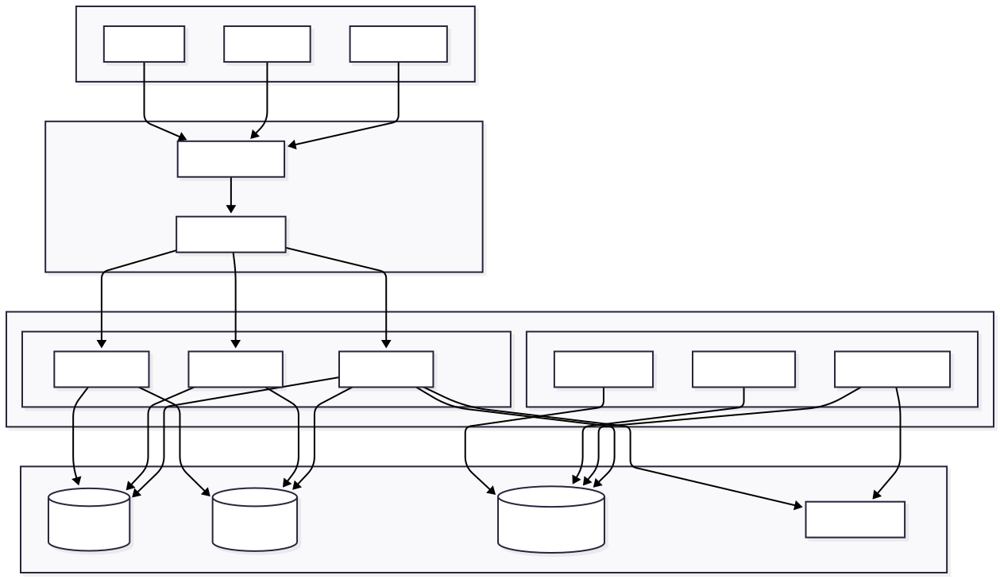

# Architecture Overview

SaaS Photo Listing  is built with a focus on **multi-tenancy**, **scalability**, and **maintainability**. This document outlines the high-level architecture, design decisions, and technical considerations.

## System Architecture

### High-Level Overview

## Core Design Principles
1. **Multi-Tenancy First**: Complete data isolation at every layer

2. **Domain-Driven Design**: Business logic centered around domain models

3. **Clean Architecture**: Separation of concerns with clear boundaries

4. **Event-Driven**: Loose coupling between components

5. **Production-First**: Observability, security, and reliability built-in

## Multi-Tenancy Architecture

### Tenant Isolation Layers

| Layer     | Isolation Method        | Implementation                                  |
|-----------|-------------------------|-------------------------------------------------|
| Database  | Row-Level Security (RLS)| PostgreSQL policies with `tenant_id`            |
| Storage   | Path Prefixing          | `tenants/{tenant-id}/` in R2/S3                 |
| Cache     | Key Namespacing         | `tenant:{tenant-id}:{key}`                      |
| Events    | Tenant Context          | Events include `tenant_id` metadata             |
| Compute   | Request Context         | JWT claims with tenant context                  |

### Additional Resources

- [Detailed Architecture Documentation](./docs/architecture/detailed.md)
- [API Reference](./docs/api.md)
- [Deployment Guide](./docs/deployment.md)
- [Security Practices](./docs/security.md)
- [Contributing Guidelines](CONTRIBUTING.md)
- [Domain Layer Documentation](./backend/internal/domains/README.md)

_Last updated on 15th June 2026 by Author: Enock Yator_
