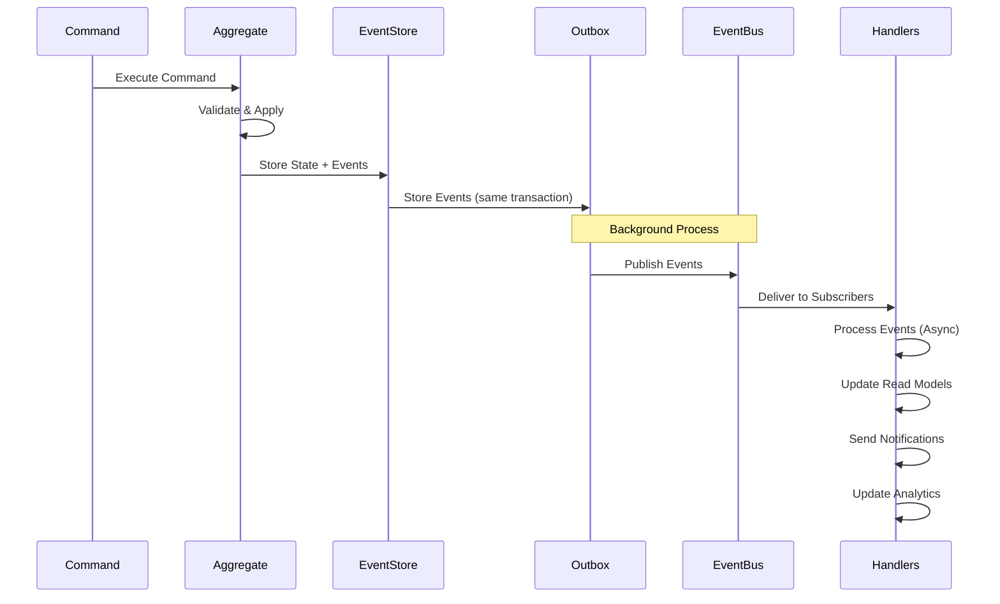

## /docs/architecture/events.md

```markdown
# Event System Architecture

Photo Listing SaaS uses an event-driven architecture to ensure loose coupling between components, reliable processing, and system extensibility.

## 🎯 Event System Goals

### Primary Objectives
1. **Loose Coupling**: Services communicate via events, not direct calls
2. **Reliability**: At-least-once delivery with idempotent handlers
3. **Extensibility**: New features can react to existing events
4. **Auditability**: Complete history of business events
5. **Scalability**: Parallel processing of independent events

### Design Principles
- **Events are facts**: Represent things that have already happened
- **Events are immutable**: Cannot be changed after publication
- **Events are named in past tense**: `AlbumCreated`, `PhotoUploaded`
- **Events contain business context**: Include tenant, user, and relevant data
- **Events are versioned**: Schema evolution support

## 🏗️ Event Architecture

### Event Flow



Event Types Hierarchy
text

Event (Base Interface)
├── DomainEvent (Business Facts)
│   ├── Album Events
│   │   ├── AlbumCreated
│   │   ├── AlbumPublished
│   │   ├── AlbumArchived
│   │   └── AlbumShared
│   │
│   ├── Photo Events
│   │   ├── PhotoUploaded
│   │   ├── PhotoProcessed
│   │   ├── PhotoMetadataUpdated
│   │   └── PhotoDeleted
│   │
│   ├── User Events
│   │   ├── UserInvited
│   │   ├── UserRoleChanged
│   │   └── UserDeleted
│   │
│   └── Billing Events
│       ├── SubscriptionCreated
│       ├── SubscriptionUpgraded
│       ├── PaymentSucceeded
│       └── SubscriptionCanceled
│
└── IntegrationEvent (External Communication)
    ├── EmailNotification
    ├── AnalyticsEvent
    ├── WebhookEvent
    └── ThirdPartySyncEvent

🔧 Implementation
Event Structure
go

// Base event interface
type Event interface {
    EventID() string
    AggregateID() string
    AggregateType() string
    EventType() string
    TenantID() string
    Timestamp() time.Time
    Data() interface{}
    Metadata() map[string]interface{}
    Version() int
}

// Concrete domain event
type AlbumCreated struct {
    eventID      string
    albumID      string
    tenantID     string
    userID       string
    title        string
    visibility   string
    timestamp    time.Time
    metadata     map[string]interface{}
}

func (e AlbumCreated) EventID() string {
    return e.eventID
}

func (e AlbumCreated) AggregateID() string {
    return e.albumID
}

func (e AlbumCreated) AggregateType() string {
    return "album"
}

func (e AlbumCreated) EventType() string {
    return "album.created"
}

func (e AlbumCreated) TenantID() string {
    return e.tenantID
}

func (e AlbumCreated) Timestamp() time.Time {
    return e.timestamp
}

func (e AlbumCreated) Data() interface{} {
    return map[string]interface{}{
        "title":      e.title,
        "visibility": e.visibility,
        "user_id":    e.userID,
    }
}

func (e AlbumCreated) Metadata() map[string]interface{} {
    return e.metadata
}

func (e AlbumCreated) Version() int {
    return 1
}

Event Store Implementation
go

// Event store interface
type EventStore interface {
    Append(ctx context.Context, events []Event) error
    Load(ctx context.Context, aggregateID string) ([]Event, error)
    LoadByType(ctx context.Context, eventType string) ([]Event, error)
    LoadByTenant(ctx context.Context, tenantID string) ([]Event, error)
}

// PostgreSQL event store implementation
type PostgresEventStore struct {
    db *sql.DB
}

func (es *PostgresEventStore) Append(ctx context.Context, events []Event) error {
    return es.db.InTransaction(ctx, func(tx *sql.Tx) error {
        for _, event := range events {
            query := `
                INSERT INTO events (
                    id, aggregate_id, aggregate_type,
                    event_type, tenant_id, data,
                    metadata, version, timestamp
                ) VALUES ($1, $2, $3, $4, $5, $6, $7, $8, $9)
            `
            
            _, err := tx.ExecContext(ctx, query,
                event.EventID(),
                event.AggregateID(),
                event.AggregateType(),
                event.EventType(),
                event.TenantID(),
                json.Marshal(event.Data()),
                json.Marshal(event.Metadata()),
                event.Version(),
                event.Timestamp(),
            )
            
            if err != nil {
                return err
            }
        }
        return nil
    })
}

Transactional Outbox Pattern
go

// Outbox table for reliable messaging
CREATE TABLE event_outbox (
    id BIGSERIAL PRIMARY KEY,
    event_id UUID NOT NULL,
    aggregate_id UUID NOT NULL,
    aggregate_type VARCHAR(100) NOT NULL,
    event_type VARCHAR(100) NOT NULL,
    tenant_id UUID NOT NULL,
    payload JSONB NOT NULL,
    created_at TIMESTAMP DEFAULT NOW(),
    processed_at TIMESTAMP,
    retry_count INTEGER DEFAULT 0,
    error_message TEXT
);

// Outbox processor
type OutboxProcessor struct {
    db        *sql.DB
    eventBus  EventBus
    logger    Logger
}

func (p *OutboxProcessor) Process(ctx context.Context) error {
    // Fetch unprocessed events
    rows, err := p.db.QueryContext(ctx, `
        SELECT id, event_type, payload
        FROM event_outbox
        WHERE processed_at IS NULL
        AND (retry_count < 3 OR retry_count IS NULL)
        ORDER BY created_at
        FOR UPDATE SKIP LOCKED
        LIMIT 100
    `)
    
    for rows.Next() {
        var outboxID int64
        var eventType string
        var payload []byte
        
        rows.Scan(&outboxID, &eventType, &payload)
        
        // Publish to event bus
        if err := p.eventBus.Publish(ctx, eventType, payload); err != nil {
            // Update retry count
            p.db.ExecContext(ctx, `
                UPDATE event_outbox
                SET retry_count = COALESCE(retry_count, 0) + 1,
                    error_message = $1
                WHERE id = $2
            `, err.Error(), outboxID)
            
            p.logger.Warn("failed to publish event",
                "outbox_id", outboxID,
                "error", err,
            )
            
            continue
        }
        
        // Mark as processed
        p.db.ExecContext(ctx, `
            UPDATE event_outbox
            SET processed_at = NOW()
            WHERE id = $1
        `, outboxID)
    }
    
    return nil
}

🚀 NATS JetStream Configuration
Stream Configuration
go

func SetupEventStream() (nats.JetStreamContext, error) {
    nc, _ := nats.Connect(nats.DefaultURL)
    js, _ := nc.JetStream()
    
    // Create stream for domain events
    stream, err := js.AddStream(&nats.StreamConfig{
        Name:     "DOMAIN_EVENTS",
        Subjects: []string{
            "events.album.*",
            "events.photo.*",
            "events.user.*",
            "events.billing.*",
        },
        Retention:    nats.WorkQueuePolicy,
        MaxAge:       7 * 24 * time.Hour, // Keep for 7 days
        Storage:      nats.FileStorage,
        Replicas:     1,
        Discard:      nats.DiscardOld,
        MaxMsgs:      1_000_000,
        MaxBytes:     1 * 1024 * 1024 * 1024, // 1GB
    })
    
    // Create stream for integration events
    js.AddStream(&nats.StreamConfig{
        Name:     "INTEGRATION_EVENTS",
        Subjects: []string{"integration.*"},
        Retention: nats.LimitsPolicy,
        MaxAge:   24 * time.Hour,
    })
    
    return js, nil
}

Consumer Configuration
go

func RegisterEventConsumers(js nats.JetStreamContext) {
    // Email notification consumer
    js.AddConsumer("DOMAIN_EVENTS", &nats.ConsumerConfig{
        Durable:        "EMAIL_NOTIFIER",
        Description:    "Sends email notifications",
        FilterSubject:  "events.album.published,events.client.selection_submitted",
        AckWait:        30 * time.Second,
        MaxDeliver:     5,
        AckPolicy:      nats.AckExplicitPolicy,
        DeliverPolicy:  nats.DeliverNewPolicy,
        MaxAckPending:  100,
        RateLimit:      10, // messages per second
    })
    
    // Analytics consumer
    js.AddConsumer("DOMAIN_EVENTS", &nats.ConsumerConfig{
        Durable:        "ANALYTICS_PROCESSOR",
        Description:    "Updates analytics data",
        FilterSubject:  "events.>",
        AckWait:        60 * time.Second,
        MaxDeliver:     3,
        AckPolicy:      nats.AckExplicitPolicy,
        DeliverPolicy:  nats.DeliverNewPolicy,
        MaxAckPending:  1000,
    })
    
    // Webhook consumer
    js.AddConsumer("DOMAIN_EVENTS", &nats.ConsumerConfig{
        Durable:        "WEBHOOK_DISPATCHER",
        Description:    "Dispatches webhook events",
        FilterSubject:  "events.album.*,events.photo.uploaded",
        AckWait:        10 * time.Second,
        MaxDeliver:     10,
        AckPolicy:      nats.AckExplicitPolicy,
        DeliverPolicy:  nats.DeliverNewPolicy,
        MaxAckPending:  100,
    })
}

🎯 Event Handlers
Handler Interface
go

type EventHandler interface {
    Handle(ctx context.Context, event Event) error
    EventTypes() []string
    Name() string
}

// Base handler with common functionality
type BaseHandler struct {
    name        string
    eventTypes  []string
    logger      Logger
    metrics     MetricsCollector
    retryPolicy RetryPolicy
}

func (h *BaseHandler) EventTypes() []string {
    return h.eventTypes
}

func (h *BaseHandler) Name() string {
    return h.name
}

func (h *BaseHandler) HandleWithRetry(ctx context.Context, event Event, fn func() error) error {
    var lastErr error
    
    for attempt := 1; attempt <= h.retryPolicy.MaxAttempts; attempt++ {
        err := fn()
        if err == nil {
            h.metrics.RecordSuccess(h.name, event.EventType())
            return nil
        }
        
        lastErr = err
        h.logger.Warn("handler failed",
            "handler", h.name,
            "event_type", event.EventType(),
            "attempt", attempt,
            "error", err,
        )
        
        if attempt < h.retryPolicy.MaxAttempts {
            delay := h.retryPolicy.Backoff(attempt)
            time.Sleep(delay)
        }
    }
    
    h.metrics.RecordFailure(h.name, event.EventType())
    return fmt.Errorf("handler %s failed after %d attempts: %w",
        h.name, h.retryPolicy.MaxAttempts, lastErr)
}

Concrete Handlers
Email Notification Handler
go

type EmailNotificationHandler struct {
    BaseHandler
    emailClient EmailClient
    templates   TemplateRepository
}

func NewEmailNotificationHandler() *EmailNotificationHandler {
    return &EmailNotificationHandler{
        BaseHandler: BaseHandler{
            name:       "email_notification",
            eventTypes: []string{
                "album.published",
                "client.selection_submitted",
                "user.invited",
            },
        },
    }
}

func (h *EmailNotificationHandler) Handle(ctx context.Context, event Event) error {
    return h.HandleWithRetry(ctx, event, func() error {
        switch e := event.(type) {
        case AlbumPublished:
            return h.handleAlbumPublished(ctx, e)
        case ClientSelectionSubmitted:
            return h.handleClientSelection(ctx, e)
        case UserInvited:
            return h.handleUserInvited(ctx, e)
        default:
            return nil // Ignore unknown event types
        }
    })
}

func (h *EmailNotificationHandler) handleAlbumPublished(ctx context.Context, event AlbumPublished) error {
    // Get album details
    album, err := h.getAlbum(ctx, event.AlbumID)
    if err != nil {
        return err
    }
    
    // Check if notifications are enabled
    if !album.Settings.Notifications.EmailOnPublish {
        return nil
    }
    
    // Prepare email
    email := Email{
        To:      album.OwnerEmail,
        Subject: fmt.Sprintf("Your album '%s' is now live!", album.Title),
        Body:    h.templates.Render("album_published", album),
    }
    
    // Send email
    return h.emailClient.Send(ctx, email)
}

Analytics Handler
go

type AnalyticsEventHandler struct {
    BaseHandler
    analyticsDB *sql.DB
    cache       Cache
}

func (h *AnalyticsEventHandler) Handle(ctx context.Context, event Event) error {
    // Update real-time counters
    h.updateRealtimeMetrics(ctx, event)
    
    // Update time-series data
    h.updateTimeseriesData(ctx, event)
    
    // Update aggregate statistics
    h.updateAggregateStats(ctx, event)
    
    // Cache invalidation if needed
    h.invalidateCache(ctx, event)
    
    return nil
}

func (h *AnalyticsEventHandler) updateRealtimeMetrics(ctx context.Context, event Event) {
    tenantID := event.TenantID()
    
    // Increment counters
    h.analyticsDB.ExecContext(ctx, `
        INSERT INTO realtime_metrics (tenant_id, metric, value, timestamp)
        VALUES ($1, $2, 1, NOW())
        ON CONFLICT (tenant_id, metric, DATE(timestamp))
        DO UPDATE SET value = realtime_metrics.value + 1
    `, tenantID, event.EventType())
}

func (h *AnalyticsEventHandler) updateTimeseriesData(ctx context.Context, event Event) {
    // Store event in timeseries table
    h.analyticsDB.ExecContext(ctx, `
        INSERT INTO event_timeseries (
            timestamp, tenant_id, event_type,
            aggregate_type, aggregate_id, data
        ) VALUES (NOW(), $1, $2, $3, $4, $5)
    `,
        event.TenantID(),
        event.EventType(),
        event.AggregateType(),
        event.AggregateID(),
        json.Marshal(event.Data()),
    )
}

Webhook Dispatcher
go

type WebhookDispatcher struct {
    BaseHandler
    httpClient *http.Client
    webhookRepo WebhookRepository
}

func (h *WebhookDispatcher) Handle(ctx context.Context, event Event) error {
    // Get active webhooks for this tenant and event type
    webhooks, err := h.webhookRepo.FindByTenantAndEvent(
        ctx, event.TenantID(), event.EventType())
    if err != nil {
        return err
    }
    
    // Dispatch to each webhook in parallel
    var wg sync.WaitGroup
    errors := make(chan error, len(webhooks))
    
    for _, webhook := range webhooks {
        wg.Add(1)
        go func(wh Webhook) {
            defer wg.Done()
            if err := h.dispatchToWebhook(ctx, wh, event); err != nil {
                errors <- err
            }
        }(webhook)
    }
    
    wg.Wait()
    close(errors)
    
    // Collect errors
    var errs []error
    for err := range errors {
        errs = append(errs, err)
    }
    
    if len(errs) > 0 {
        return fmt.Errorf("webhook dispatch errors: %v", errs)
    }
    
    return nil
}

func (h *WebhookDispatcher) dispatchToWebhook(ctx context.Context, webhook Webhook, event Event) error {
    payload := WebhookPayload{
        ID:        uuid.New().String(),
        Type:      event.EventType(),
        Timestamp: time.Now(),
        TenantID:  event.TenantID(),
        Data:      event.Data(),
    }
    
    // Sign payload
    signature := h.signPayload(payload, webhook.Secret)
    
    req, err := http.NewRequestWithContext(ctx, "POST", webhook.URL, 
        bytes.NewReader(json.Marshal(payload)))
    if err != nil {
        return err
    }
    
    req.Header.Set("Content-Type", "application/json")
    req.Header.Set("X-PhotoListing-Signature", signature)
    req.Header.Set("X-PhotoListing-Event", event.EventType())
    
    resp, err := h.httpClient.Do(req)
    if err != nil {
        return err
    }
    defer resp.Body.Close()
    
    if resp.StatusCode >= 400 {
        return fmt.Errorf("webhook returned status %d", resp.StatusCode)
    }
    
    return nil
}

📊 Event Schema Management
Schema Registry
go

// Event schema definition
type EventSchema struct {
    Name        string                 `json:"name"`
    Version     int                    `json:"version"`
    Description string                 `json:"description"`
    Schema      map[string]interface{} `json:"schema"` // JSON Schema
    Examples    []interface{}          `json:"examples"`
    Deprecated  bool                   `json:"deprecated"`
    DeprecationDate *time.Time         `json:"deprecation_date,omitempty"`
}

// Schema registry
type SchemaRegistry struct {
    schemas map[string]EventSchema
}

func (r *SchemaRegistry) Register(schema EventSchema) {
    key := fmt.Sprintf("%s.v%d", schema.Name, schema.Version)
    r.schemas[key] = schema
}

func (r *SchemaRegistry) Get(name string, version int) (EventSchema, bool) {
    key := fmt.Sprintf("%s.v%d", name, version)
    schema, exists := r.schemas[key]
    return schema, exists
}

func (r *SchemaRegistry) Validate(event Event) error {
    schema, exists := r.Get(event.EventType(), event.Version())
    if !exists {
        return fmt.Errorf("unknown event type: %s v%d", 
            event.EventType(), event.Version())
    }
    
    // Validate against JSON Schema
    return r.validateAgainstSchema(event.Data(), schema.Schema)
}

Schema Evolution
json

{
  "album.created": {
    "v1": {
      "schema": {
        "type": "object",
        "properties": {
          "title": {"type": "string"},
          "visibility": {"type": "string"}
        },
        "required": ["title"]
      }
    },
    "v2": {
      "schema": {
        "type": "object",
        "properties": {
          "title": {"type": "string"},
          "visibility": {"type": "string"},
          "description": {"type": "string"},
          "settings": {"type": "object"}
        },
        "required": ["title", "visibility"]
      },
      "migration": {
        "from": "v1",
        "script": "function migrate(data) { data.visibility = data.visibility || 'private'; return data; }"
      }
    }
  }
}

🛡️ Event Security
Event Authorization
go

type EventAuthorizer struct {
    policyRepo PolicyRepository
}

func (a *EventAuthorizer) Authorize(ctx context.Context, event Event, handler EventHandler) error {
    // Get tenant policies
    policies, err := a.policyRepo.GetTenantPolicies(ctx, event.TenantID())
    if err != nil {
        return err
    }
    
    // Check if handler is allowed for this event
    for _, policy := range policies {
        if policy.Matches(event, handler) {
            if policy.Allow {
                return nil
            } else {
                return fmt.Errorf("handler %s not authorized for event %s",
                    handler.Name(), event.EventType())
            }
        }
    }
    
    // Default deny
    return fmt.Errorf("unauthorized: no policy matches")
}

Event Encryption
go

type EncryptedEventBus struct {
    eventBus    EventBus
    encryption  EncryptionService
    tenantKeys  map[string]string // Tenant ID -> encryption key ID
}

func (e *EncryptedEventBus) Publish(ctx context.Context, event Event) error {
    // Get tenant encryption key
    keyID, exists := e.tenantKeys[event.TenantID()]
    if !exists {
        return fmt.Errorf("no encryption key for tenant %s", event.TenantID())
    }
    
    // Encrypt sensitive data
    encryptedData, err := e.encryption.Encrypt(event.Data(), keyID)
    if err != nil {
        return err
    }
    
    // Create encrypted event
    encryptedEvent := EncryptedEvent{
        OriginalEvent: event,
        EncryptedData: encryptedData,
        KeyID:         keyID,
        Algorithm:     "AES-256-GCM",
    }
    
    // Publish encrypted event
    return e.eventBus.Publish(ctx, encryptedEvent)
}

📈 Monitoring & Observability
Event Metrics
go

type EventMetrics struct {
    eventsPublished     *prometheus.CounterVec
    eventsProcessed     *prometheus.CounterVec
    processingDuration  *prometheus.HistogramVec
    deadLetterEvents    *prometheus.CounterVec
    handlerErrors       *prometheus.CounterVec
}

func NewEventMetrics() *EventMetrics {
    return &EventMetrics{
        eventsPublished: prometheus.NewCounterVec(
            prometheus.CounterOpts{
                Name: "events_published_total",
                Help: "Total events published by type",
            },
            []string{"event_type", "tenant_id"},
        ),
        eventsProcessed: prometheus.NewCounterVec(
            prometheus.CounterOpts{
                Name: "events_processed_total",
                Help: "Total events processed by handler",
            },
            []string{"handler", "event_type", "tenant_id", "status"},
        ),
        processingDuration: prometheus.NewHistogramVec(
            prometheus.HistogramOpts{
                Name:    "event_processing_duration_seconds",
                Help:    "Event processing duration distribution",
                Buckets: prometheus.DefBuckets,
            },
            []string{"handler", "event_type", "tenant_id"},
        ),
    }
}

Event Tracing
go

func InstrumentedEventHandler(handler EventHandler, tracer trace.Tracer) EventHandler {
    return &instrumentedHandler{
        handler: handler,
        tracer:  tracer,
    }
}

type instrumentedHandler struct {
    handler EventHandler
    tracer  trace.Tracer
}

func (h *instrumentedHandler) Handle(ctx context.Context, event Event) error {
    ctx, span := h.tracer.Start(ctx, 
        fmt.Sprintf("EventHandler.%s", h.handler.Name()),
        trace.WithAttributes(
            attribute.String("event.type", event.EventType()),
            attribute.String("tenant.id", event.TenantID()),
            attribute.String("handler.name", h.handler.Name()),
        ))
    defer span.End()
    
    start := time.Now()
    err := h.handler.Handle(ctx, event)
    duration := time.Since(start)
    
    if err != nil {
        span.SetStatus(codes.Error, err.Error())
        span.RecordError(err)
    }
    
    // Record metrics
    metrics.EventProcessingDuration.WithLabelValues(
        h.handler.Name(),
        event.EventType(),
        event.TenantID(),
    ).Observe(duration.Seconds())
    
    return err
}

🔄 Event Replay & Recovery
Event Replay System
go

type EventReplayService struct {
    eventStore EventStore
    eventBus   EventBus
    logger     Logger
}

func (s *EventReplayService) ReplayEvents(ctx context.Context, req ReplayRequest) error {
    // Get events to replay
    events, err := s.eventStore.LoadByCriteria(ctx, req.Criteria)
    if err != nil {
        return err
    }
    
    s.logger.Info("starting event replay",
        "event_count", len(events),
        "criteria", req.Criteria,
    )
    
    // Process events in batches
    batchSize := 100
    for i := 0; i < len(events); i += batchSize {
        end := i + batchSize
        if end > len(events) {
            end = len(events)
        }
        
        batch := events[i:end]
        
        // Replay each event
        for _, event := range batch {
            if err := s.replayEvent(ctx, event); err != nil {
                s.logger.Error("failed to replay event",
                    "event_id", event.EventID(),
                    "event_type", event.EventType(),
                    "error", err,
                )
                
                if req.StopOnError {
                    return err
                }
            }
        }
    }
    
    s.logger.Info("event replay completed",
        "total_events", len(events),
        "successful", s.metrics.SuccessCount,
        "failed", s.metrics.FailureCount,
    )
    
    return nil
}

func (s *EventReplayService) replayEvent(ctx context.Context, event Event) error {
    // Check if handler should process this event
    if !s.shouldReplay(event) {
        return nil
    }
    
    // Create new event with replay metadata
    replayEvent := ReplayEvent{
        OriginalEvent: event,
        ReplayID:      uuid.New().String(),
        ReplayedAt:    time.Now(),
        Reason:        "manual_replay",
    }
    
    // Publish to event bus
    return s.eventBus.Publish(ctx, replayEvent)
}

Dead Letter Queue
go

type DeadLetterQueue struct {
    db     *sql.DB
    logger Logger
}

func (q *DeadLetterQueue) Store(ctx context.Context, event Event, handler string, err error) error {
    return q.db.ExecContext(ctx, `
        INSERT INTO dead_letter_queue (
            id, event_type, aggregate_id,
            tenant_id, payload, handler_name,
            error_message, error_stack, created_at
        ) VALUES ($1, $2, $3, $4, $5, $6, $7, $8, $9)
    `,
        uuid.New().String(),
        event.EventType(),
        event.AggregateID(),
        event.TenantID(),
        json.Marshal(event.Data()),
        handler,
        err.Error(),
        debug.Stack(),
        time.Now(),
    )
}

func (q *DeadLetterQueue) Retry(ctx context.Context, dlqID string) error {
    // Get dead letter event
    var event Event
    var handler string
    
    err := q.db.QueryRowContext(ctx, `
        SELECT payload, handler_name
        FROM dead_letter_queue
        WHERE id = $1
    `, dlqID).Scan(&event, &handler)
    
    if err != nil {
        return err
    }
    
    // Get handler and retry
    handler := q.getHandler(handler)
    if handler == nil {
        return fmt.Errorf("handler not found: %s", handler)
    }
    
    // Retry processing
    if err := handler.Handle(ctx, event); err != nil {
        // Update retry count
        q.db.ExecContext(ctx, `
            UPDATE dead_letter_queue
            SET retry_count = retry_count + 1,
                last_retry_at = NOW()
            WHERE id = $1
        `, dlqID)
        
        return err
    }
    
    // Mark as processed
    q.db.ExecContext(ctx, `
        UPDATE dead_letter_queue
        SET processed_at = NOW(),
            status = 'retried'
        WHERE id = $1
    `, dlqID)
    
    return nil
}

🧪 Testing Events
Event Testing Utilities
go

// Event test helper
type EventTestHelper struct {
    eventStore EventStore
    published  []Event
}

func (h *EventTestHelper) GivenEvents(events ...Event) {
    for _, event := range events {
        h.eventStore.Append(context.Background(), []Event{event})
    }
}

func (h *EventTestHelper) WhenCommand(command Command) error {
    return command.Execute()
}

func (h *EventTestHelper) ThenEvents(expected ...Event) error {
    published := h.getPublishedEvents()
    
    if len(published) != len(expected) {
        return fmt.Errorf("expected %d events, got %d", 
            len(expected), len(published))
    }
    
    for i, expectedEvent := range expected {
        if !eventsEqual(published[i], expectedEvent) {
            return fmt.Errorf("event %d mismatch", i)
        }
    }
    
    return nil
}

// Unit test example
func TestAlbum_Publish(t *testing.T) {
    helper := NewEventTestHelper()
    
    // Given an album in draft state
    album := domain.NewAlbum("tenant-123", "Test Album", "Description")
    helper.GivenEvents(AlbumCreated{
        AlbumID:   album.ID,
        TenantID:  album.TenantID,
        Title:     album.Title,
    })
    
    // When publishing the album
    err := helper.WhenCommand(PublishAlbumCommand{
        AlbumID: album.ID,
        UserID:  "user-123",
    })
    
    // Then album published event should be emitted
    assert.NoError(t, err)
    assert.NoError(t, helper.ThenEvents(
        AlbumPublished{
            AlbumID:     album.ID,
            TenantID:    album.TenantID,
            PublishedBy: "user-123",
        },
    ))
}

Integration Test
go

func TestEventHandlingIntegration(t *testing.T) {
    // Setup test environment
    container := testcontainers.PostgreSQLContainer{}
    defer container.Terminate()
    
    // Create event bus and handlers
    eventBus := NewNatsEventBus()
    emailHandler := NewEmailNotificationHandler()
    analyticsHandler := NewAnalyticsEventHandler()
    
    // Subscribe handlers
    eventBus.Subscribe("album.published", emailHandler)
    eventBus.Subscribe("album.published", analyticsHandler)
    
    // Publish event
    event := AlbumPublished{
        AlbumID:  "album-123",
        TenantID: "tenant-123",
        Title:    "Test Album",
    }
    
    err := eventBus.Publish(context.Background(), event)
    assert.NoError(t, err)
    
    // Wait for processing
    time.Sleep(100 * time.Millisecond)
    
    // Verify email was sent
    assert.True(t, emailHandler.EmailSent)
    
    // Verify analytics were updated
    stats, err := analyticsHandler.GetStats("tenant-123")
    assert.NoError(t, err)
    assert.Equal(t, 1, stats.AlbumsPublished)
}

📚 Event Catalog
Album Events
Event	Description	Payload
AlbumCreated	Album created in draft state	{title, description, visibility, settings}
AlbumPublished	Album made publicly accessible	{published_at, public_url}
AlbumArchived	Album moved to archive	{archived_at, reason}
AlbumShared	Share link created for album	{share_token, expires_at, permissions}
AlbumViewed	Album viewed by client or public	{viewer_type, user_agent, ip_address}
Photo Events
Event	Description	Payload
PhotoUploaded	Photo uploaded to album	{filename, size, mime_type, album_id}
PhotoProcessed	Photo processing completed	{versions: {original, web, thumbnails}, metadata}
PhotoMetadataUpdated	Photo metadata updated	{title, description, tags, rating}
PhotoDownloaded	Photo downloaded by user	{downloader_type, size, format}
PhotoDeleted	Photo deleted from album	{deleted_by, reason}
Client Events
Event	Description	Payload
ClientInvited	Client invited to album	{client_email, album_id, share_token}
ClientViewedAlbum	Client viewed shared album	{client_email, album_id, duration}
ClientSelectionSubmitted	Client submitted photo selections	{selections: [{photo_id, rating, comment}], total_selected}
ClientDownloadedPhotos	Client downloaded photos	{client_email, photo_ids, format}
Billing Events
Event	Description	Payload
SubscriptionCreated	New subscription created	{plan, amount, interval}
SubscriptionUpgraded	Subscription plan upgraded	{from_plan, to_plan, new_amount}
SubscriptionDowngraded	Subscription plan downgraded	{from_plan, to_plan, new_amount}
SubscriptionCanceled	Subscription canceled	{canceled_at, canceled_by, reason}
PaymentSucceeded	Payment successfully processed	{amount, currency, invoice_id}
PaymentFailed	Payment failed	{amount, currency, failure_reason}
🔮 Future Enhancements
Event Sourcing
go

// Future: Event-sourced aggregates
type AlbumAggregate struct {
    id       string
    tenantID string
    events   []Event
    state    AlbumState
    version  int
}

func (a *AlbumAggregate) Publish() error {
    // Validate business rules
    if a.state.Status == StatusArchived {
        return errors.New("cannot publish archived album")
    }
    
    // Apply event to state
    a.apply(AlbumPublished{
        AlbumID:     a.id,
        TenantID:    a.tenantID,
        PublishedAt: time.Now(),
    })
    
    return nil
}

func (a *AlbumAggregate) apply(event Event) {
    a.events = append(a.events, event)
    a.version++
    
    // Update state based on event
    switch e := event.(type) {
    case AlbumPublished:
        a.state.Status = StatusPublished
        a.state.PublishedAt = e.PublishedAt
    }
}

CQRS with Separate Read Models
go

// Future: Separate read model updates
type AlbumReadModel struct {
    db *sql.DB
}

func (r *AlbumReadModel) OnAlbumPublished(ctx context.Context, event AlbumPublished) error {
    // Update denormalized view
    return r.db.ExecContext(ctx, `
        UPDATE album_views
        SET status = 'published',
            published_at = $1,
            public_url = $2
        WHERE id = $3 AND tenant_id = $4
    `, event.PublishedAt, event.PublicURL, event.AlbumID, event.TenantID)
}

func (r *AlbumReadModel) OnPhotoUploaded(ctx context.Context, event PhotoUploaded) error {
    // Update photo count
    return r.db.ExecContext(ctx, `
        UPDATE album_views
        SET photo_count = photo_count + 1,
            updated_at = NOW()
        WHERE id = $1 AND tenant_id = $2
    `, event.AlbumID, event.TenantID)
}

This event system provides a robust foundation for building scalable, maintainable, and extensible features. All new features should emit appropriate domain events and subscribe to existing events where applicable.